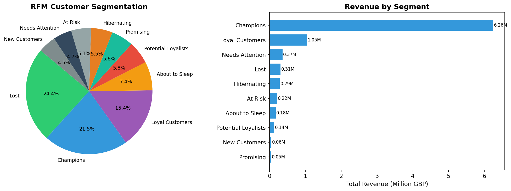
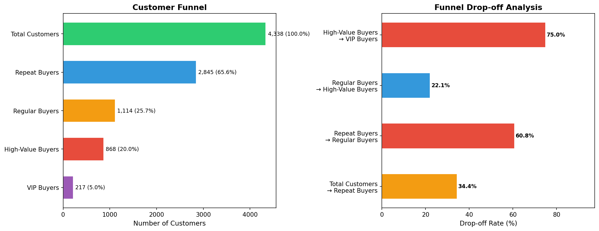
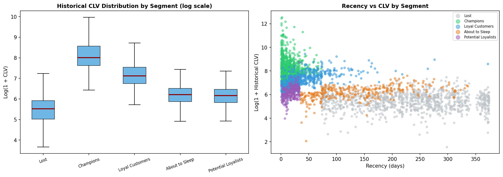

# 📊 E-Commerce RFM Analysis

[](https://github.com/886ss/ecommerce-rfm-analysis/actions/workflows/ci.yml)


> 基于 **UCI Online Retail** 真实交易数据的电商用户行为分析项目  
> RFM 分层 + 漏斗归因 + CLV 估算 — 完整用户价值分析链路  
> **可配置、可复用、面试可讲 30min+ 的产品级项目**

---

## 数据集

**UCI Machine Learning Repository — Online Retail Dataset**

| 指标 | 数值 |
|------|------|
| 原始行数 | 541,909 |
| 清洗后行数 | 397,884 |
| 唯一客户 | 4,338 |
| 唯一订单 | 18,532 |
| 时间范围 | 2010-12-01 ~ 2011-12-09 |
| 总营收 | £8,911,408 |
| 数据地址 | https://archive.ics.uci.edu/dataset/352/online+retail |

> 请将 `Online Retail.xlsx` 放入 `data/` 目录后运行。

---

## 换一份数据怎么跑

如果你的 Excel 列名不是 UCI 标准名（`CustomerID` / `InvoiceNo` 等），**只需改一个文件**：

```bash
# 1. 编辑 column_mapping.toml，把你的列名映射到内部标准名
#    例如：customer_id = "user_id"  →  所有代码自动适配

# 2. 一行命令跑全流程
python -m src.main --data ./data/xxx.xlsx --mapping ./column_mapping.toml

# 3. 如果你的业务阈值不同（如"复购=3次"而非 2 次）
#    编辑 business_params.toml，然后：
python -m src.main --data ./data/xxx.xlsx --params ./business_params.toml
```

**全 CLI 参数**：

| 参数 | 说明 |
|------|------|
| `--data PATH` | 数据文件路径 |
| `--output PATH` | 输出目录（默认 `output/`） |
| `--mapping PATH` | 列名映射配置（`column_mapping.toml`） |
| `--params PATH` | 业务参数配置（`business_params.toml`） |
| `--only {rfm,funnel,clv}` | 只运行一个模块 |
| `--no-plot` | 跳过图表（CI / 无 GUI 环境） |
| `--log-level LEVEL` | 日志级别（DEBUG/INFO/WARNING/ERROR） |

**程序化 API（保持兼容）**：

```python
from src.data_preprocessing import load_and_clean
from src.schema import load_column_mapping
from src.rfm_analysis import run_rfm

mapping = load_column_mapping("column_mapping.toml")
df = load_and_clean("data/my_orders.xlsx", mapping=mapping)
rfm, summary = run_rfm(df, "output/")
```

---

## 项目结构

```text
ecommerce-rfm-analysis/
├── .github/workflows/ci.yml     // push 自动 pytest + mypy + ruff
├── pyproject.toml               // 包配置 + mypy/ruff/pytest 配置
├── column_mapping.toml          // 列名映射（换数据只改这个）
├── business_params.toml         // 业务阈值（漏斗/CLV 参数）
├── requirements.txt
├── src/
│   ├── __init__.py
│   ├── config.py                // 路径/常量/日志/业务参数加载
│   ├── schema.py                // 列名映射 + 输入校验（新增）
│   ├── plotting.py              // matplotlib Agg + 颜色调色板 + save_chart
│   ├── main.py                  // argparse CLI 入口
│   ├── data_preprocessing.py    // 数据加载 + 列名rename + 清洗
│   ├── rfm_analysis.py          // RFM 分层
│   ├── funnel_attribution.py    // 漏斗归因（阈值可配置）
│   └── clv_estimation.py        // CLV 估算（参数可配置）
├── tests/
│   ├── conftest.py
│   ├── test_data_preprocessing.py
│   ├── test_rfm_analysis.py
│   ├── test_funnel_attribution.py
│   └── test_clv_estimation.py
├── docs/
│   ├── PLAN.md                  // 分阶段执行计划
│   ├── ARCHITECTURE.md          // 数据流图 + 设计决策 + 扩展指南
│   ├── MODULES.md               // 15 个函数签名索引
│   └── MEETING_NOTES.md         // 通信纪要
├── data/                        // (gitignored) 原始数据
└── output/                      // (gitignored) 生成图表和 CSV
```

---

## 验收标准

| 门 | 命令 | 状态 |
|----|------|------|
| 测试 | `pytest -v` | 29 passed ✅ |
| 类型 | `mypy src/ --strict` | 0 errors ✅ |
| Lint | `ruff check src/ tests/` | All checks passed ✅ |
| CI | push → GitHub Actions | 自动运行上述三项 |

---

## 三大分析模块

### 1. RFM 客户分层 (`rfm_analysis.py`)

**方法**：五分位评分法 + 10 类标准分段。向量化 `np.select` ~10× 加速。



| 分段 | 客户占比 | 营收贡献 |
|------|:---:|:---:|
| Champions | 21.5% | **70.2%** |
| Loyal Customers | 15.4% | 11.8% |

### 2. 漏斗归因分析 (`funnel_attribution.py`)

5 层转化漏斗，阈值通过 `business_params.toml` 可配置。



→ 最大流失点：首购后 **65.6% 流失**

### 3. CLV 生命周期价值估算 (`clv_estimation.py`)

双重 CLV（历史 + 预测），参数可通过 `business_params.toml` 调整。



| 指标 | 数值 |
|------|------|
| 人均 Historical CLV | £2,054 |
| 中位数 | £674 |

> ⚠️ Predictive CLV 使用朴素线性外推模型，仅供演示。生产环境建议 BG/NBD。

---

## 快速开始

```bash
pip install -r requirements.txt
python -m src.main --data ./data/Online Retail.xlsx
pytest -v
```

## 技术栈

```
Python 3.12
├── pandas~=2.0      — 数据处理
├── numpy~=1.24      — 数值计算
├── matplotlib~=3.7  — 可视化
└── openpyxl~=3.1    — Excel 读取
开发工具: mypy (strict) | ruff | pytest | GitHub Actions
```
